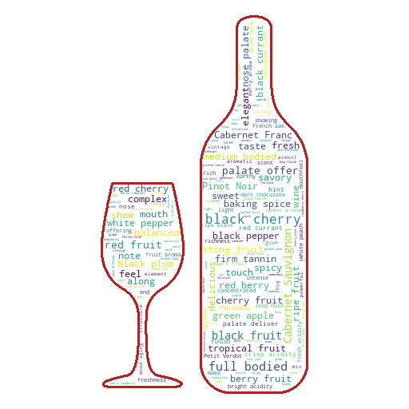

# Generating Word Clouds in Python

Learn how to perform Exploratory Data Analysis for Natural Language Processing using WordCloud in Python.

The tutorial is published on [DataCamp](https://www.datacamp.com) in [here](https://www.datacamp.com/community/tutorials/wordcloud-python)

Many times you might have seen a cloud filled with lots of words in  different sizes, which represent the frequency or the importance of each  word. This is called [Tag Cloud](https://en.wikipedia.org/wiki/Tag_cloud)  or WordCloud. For this tutorial, you will learn how to create a WordCloud of your own in Python and customize it as you see fit. This tool will be quite handy for exploring text data and making your report  more lively.

In this tutorial we will use a wine review dataset taking from [Wine Enthusiast website](https://www.winemag.com/?s=&drink_type=wine) to learn:

- How to create a basic wordcloud from one to several text documents
- Adjust color, size and number of text inside your wordcloud
- Mask your wordcloud into any shape of your choice
- Mask your wordcloud into any color pattern of your **choice**

### Examples

#### A standard word cloud:

#### A word cloud in shape 

 

### Dependencies

- [numpy](http://www.numpy.org/)
- [pandas](https://pandas.pydata.org/)
- [matplotlib](https://matplotlib.org/index.html)
- [pillow](https://pillow.readthedocs.io/en/5.1.x/)
- [wordcloud](https://github.com/amueller/word_cloud)